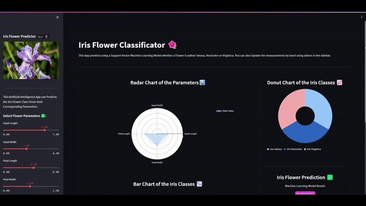
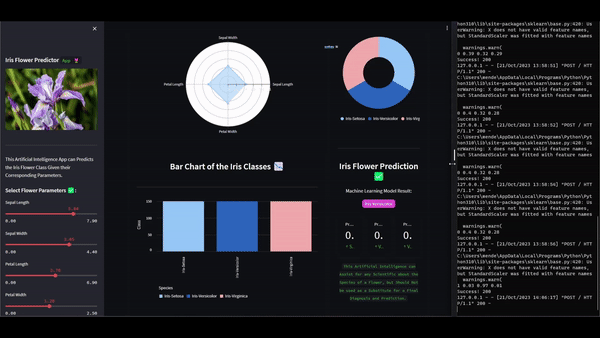

# Iris Flower Classificator with Scikit Learn, Streamlit and Deployed with Flask 



## Iris Flower Classificator with Scikit Learn, Numpy, Pandas, Streamlit and Deployed with Flask 

The Model was trained with Tabular Iris Flower Data and with the `SVC` Scikit-Learn Architecture. The Model predicts if a given Iris Flower is either `Setosa`, `Versicolo` or `Virginica`, also the U.I. to select the parameters of the Iris Flower was built with Streamlit and the API with Flask. 

## Check-it out the App Deployed in the Streamlit Services

Iris Flower Classificator App Deployed at: https://iris-flower.streamlit.app/

## Run it Locally

Test it Locally by running the `app.py` file, built with `Streamlit`, and the `api.py` file with `Flask`. Remember first to run the `api.py` file, copy the http url and saved in the API variable of the `app.py` file, and uncomment the code lines.

## App made with Streamlit
```sh
streamlit run app.py
```

## Deployed with Flash
```sh
python3 api.py
```



## Resources
- Iris Flower Dataset: https://www.kaggle.com/datasets/arshid/iris-flower-dataset
